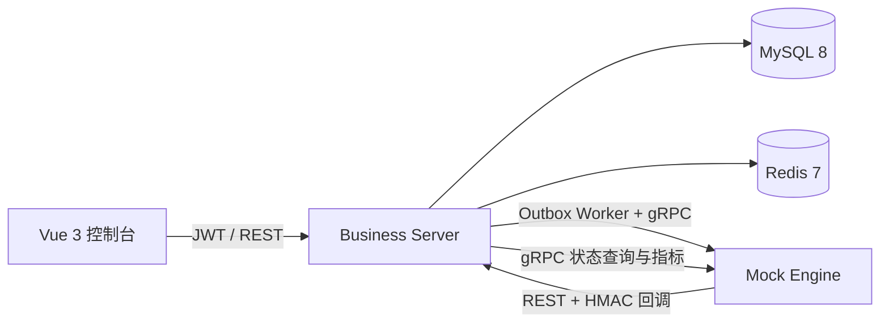

# ComputeHub 算力调度平台 Demo

作者：**yeqimin**

ComputeHub 是一个可独立运行的全栈算力调度平台，覆盖租户与权限、产品与资源、实例全生命周期、预付费钱包、异步任务和集群监控。项目通过 MySQL Outbox、gRPC Mock Engine、回调防重和人工对账展示最终一致性设计，不依赖真实云账号或 Kubernetes。

## 快速启动

准备 Docker Desktop 或 Docker Engine，并确保 8080、8088、9090、3307、6380 端口可用。在项目根目录执行：

```bash
docker compose up --build -d --wait
docker compose ps
```

首次构建需要下载镜像和依赖。全部服务就绪后访问：

- 管理控制台：http://localhost:8088
- Swagger：http://localhost:8080/swagger-ui.html
- 健康检查：http://localhost:8080/actuator/health

演示账号：

| 角色 | 账号 | 密码 | 能力 |
|---|---|---|---|
| 平台管理员 | `admin` | `Admin@123` | 管理全部租户、产品、实例和账务 |
| 租户管理员 | `tenant_admin` | `Tenant@123` | 管理本租户实例、钱包和用户 |
| 只读访客 | `viewer` | `Viewer@123` | 只读查看资源、实例和账务 |

日常停止不会删除数据：

```bash
docker compose down
```

需要恢复初始演示数据时执行 `docker compose down -v`，该命令会删除本项目的 MySQL 数据卷。

## 功能范围

- 总览：实例、任务、费用和集群指标，支持定时轮询与手动刷新。
- 资源中心：集群、节点、GPU 容量、健康状态和节点详情。
- 产品管理：筛选、新增、编辑和启停，写操作仅平台管理员可用。
- 实例控制台：创建、停止、启动、重启、逻辑删除、批量操作和状态详情。
- 任务中心：查看命令、重试次数、错误、超时状态，并执行重试或对账。
- 租户与权限：租户、用户、角色分配和用户启停，包含租户边界保护。
- 费用中心：余额、冻结金额、幂等充值和不可变账务流水。

创建实例时可以选择 `SUCCESS`、`FAIL`、`DUPLICATE_CALLBACK` 或 `TIMEOUT`，用于观察成功结算、失败解冻、重复回调防重和超时对账。

## 系统结构



- `business-server`：模块化业务单体，负责认证、租户隔离、产品、资源、实例、钱包、账本和异步任务。
- `proto`：业务服务与引擎之间的 gRPC 契约。
- `mock-engine`：持久化命令防重，模拟实例操作、回调与集群指标。
- `frontend`：Vue 3、TypeScript、Element Plus 和 ECharts 管理控制台。

当前版本采用数据库 Outbox Worker 进行可靠投递，不依赖消息队列。详细设计见 [架构与接口说明](docs/architecture.md)，索引说明见 [SQL 与慢查询设计](docs/sql-performance.md)。

## 核心流程演示

1. 使用租户管理员登录，在总览查看实例、任务、费用和集群指标。
2. 进入费用中心查看可用余额、冻结余额和账务流水。
3. 创建 `SUCCESS` 实例，观察资金先冻结、实例进入运行中、资金再完成实扣。
4. 对实例依次执行停止、启动、重启和删除，查看状态时间线与任务记录。
5. 创建 `FAIL` 实例，确认实例失败后资金自动解冻。
6. 创建 `DUPLICATE_CALLBACK` 实例，确认只产生一条 `DEDUCT` 流水。
7. 创建 `TIMEOUT` 实例，等待任务进入待对账且资金保持冻结，再在任务中心执行对账完成结算。
8. 切换只读账号，确认创建、充值和产品修改均被权限系统拒绝。

## 自动验证

服务启动后可以按需执行：

```bash
make smoke       # 登录、创建、引擎回调和结算
make lifecycle   # 创建、停止、启动、重启、删除和账务防重
make acceptance  # 失败、重复回调、超时对账、权限与租户隔离
make concurrency # 同一幂等键并发提交 50 次
make recovery    # Mock Engine 重启后的命令恢复
```

`make verify` 会依次运行后端与前端测试、启动容器，并执行核心自动验证。Node 脚本默认访问 `http://localhost:8080/api/v1`，可通过 `BASE_URL` 覆盖。

## 一致性与安全

创建实例在单个 MySQL 事务内完成钱包行锁、余额冻结、订单、实例、任务、流水和 Outbox 事件写入。事务提交后，Worker 使用 `FOR UPDATE SKIP LOCKED` 领取事件并调用 gRPC 引擎。

- HTTP 防重：Redis `SET NX` 快速拦截，MySQL `(actor_id, idempotency_key)` 唯一键最终兜底。
- 引擎防重：相同 `command_id` 持久化去重，通信重试始终复用命令号。
- 回调防重：`engine_event_id` 唯一键与实例状态机共同避免重复结算。
- 账务约束：金额统一使用整数分，流水只追加，并以业务号和类型建立唯一约束。
- 不确定结果：重试耗尽后进入 `UNKNOWN` 并保留冻结款，迟到回调或人工对账仍可继续收敛。
- 回调验签：使用五分钟时间窗口和 HMAC-SHA256 校验 `timestamp.body`。
- 访问控制：JWT、BCrypt、接口权限和服务层租户过滤共同保护数据边界。

## 本地开发

后端需要 Java 21 与 Maven 3.9，前端建议使用 Node 22：

```bash
mvn test

cd frontend
npm ci --legacy-peer-deps
npm test
npm run build
```

GitHub Actions 会执行后端测试、前端测试、生产构建和 Docker 全链路验证。项目采用 MIT License。
