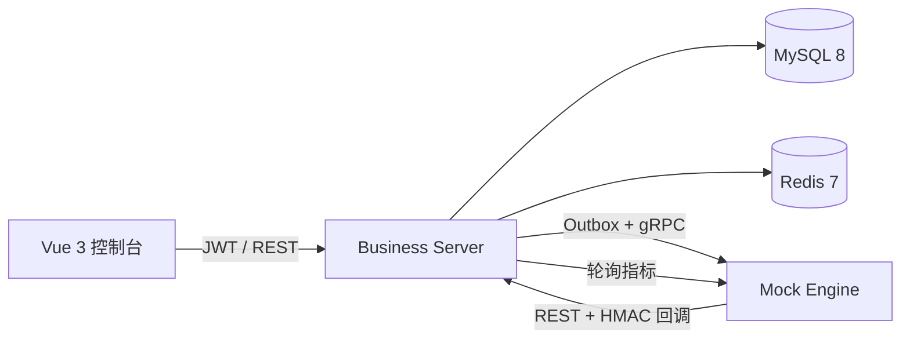

# ComputeHub 算力调度平台 Demo

作者：**yeqimin**

ComputeHub 是一个面向面试演示的全栈算力调度平台，重点展示 Java 业务架构、预付费账务最终一致性、高并发幂等、gRPC 引擎适配、异步回调和 Vue 3 管理控制台。项目不依赖真实云账号或 Kubernetes，一台安装 Docker 的电脑即可完整运行。

## 一键启动

```bash
docker compose up --build -d
```

等待容器健康后访问：

- 管理控制台：http://localhost:8088
- Swagger：http://localhost:8080/swagger-ui.html
- 健康检查：http://localhost:8080/actuator/health

演示账号：

| 角色 | 账号 | 密码 | 能力 |
|---|---|---|---|
| 平台管理员 | `admin` | `Admin@123` | 全部租户、产品、实例、账务 |
| 租户管理员 | `tenant_admin` | `Tenant@123` | 本租户实例、钱包、用户 |
| 只读访客 | `viewer` | `Viewer@123` | 只读资源与实例 |

停止服务使用 `docker compose down`，连同演示数据重置使用 `docker compose down -v`。

## 架构



- `business-server`：模块化业务单体，负责认证、租户隔离、产品、资源、实例、钱包、账本和异步任务。
- `proto`：业务层与引擎层的 gRPC 契约。
- `mock-engine`：持久化命令防重，稳定模拟成功、失败、重复回调和超时。
- `frontend`：Vue 3、TypeScript、Element Plus、ECharts 管理控制台。

## 五分钟面试演示

1. 使用租户管理员登录，在总览页观察 GPU 指标每五秒更新。
2. 进入费用中心，查看可用余额和不可变流水。
3. 在实例控制台选择“正常成功”创建实例：余额先冻结，随后实例进入运行中并完成扣款。
4. 选择“引擎失败”创建实例：看到冻结余额最终解冻。
5. 选择“重复回调”：确认只产生一条 `DEDUCT` 流水。
6. 选择“超时”：约二十秒后任务进入“待对账”，金额继续冻结；Mock Engine 十二秒后已具备查询结果，点击“对账”完成结算。
7. 使用只读账号登录，演示创建、充值和产品编辑均被 RBAC 拒绝。

自动验证主链路：

```bash
./scripts/smoke-test.sh
node ./scripts/acceptance-test.mjs
node ./scripts/idempotency-test.mjs
node ./scripts/recovery-test.mjs
```

## 一致性设计

创建实例在单个 MySQL 事务内完成钱包行锁、余额冻结、订单/实例/任务、账务流水和 Outbox 事件。提交后 Worker 使用 `FOR UPDATE SKIP LOCKED` 获取事件，并通过 gRPC 调用引擎。

- HTTP：Redis `SET NX` 快速防重，MySQL `(actor_id, idempotency_key)` 唯一键兜底。
- 引擎：相同 `command_id` 持久化防重，所有重试复用命令号。
- 回调：`engine_event_id` 唯一键 + 实例状态机双重防重。
- 账务：金额使用整数分；流水只追加；`tenant_id + biz_no + type` 唯一。
- 不确定结果：通信重试耗尽后进入 `UNKNOWN`，保留冻结款，避免错误退款造成资损。
- 回调安全：时间戳五分钟窗口，HMAC-SHA256 对 `timestamp.body` 签名。

更多细节见 [架构与接口说明](docs/architecture.md) 和 [SQL 调优说明](docs/sql-performance.md)。

## 开发与测试

```bash
# Java 21 + Maven 3.9
mvn test

# Node 22
cd frontend
npm install
npm test
npm run build
```

GitHub Actions 会执行后端测试、前端测试和生产构建。该项目采用 MIT License。
