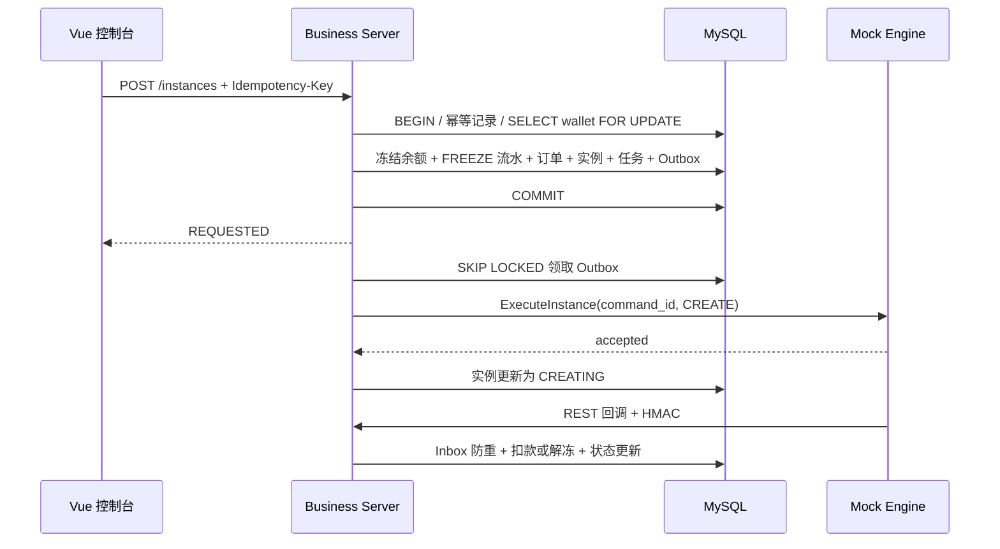
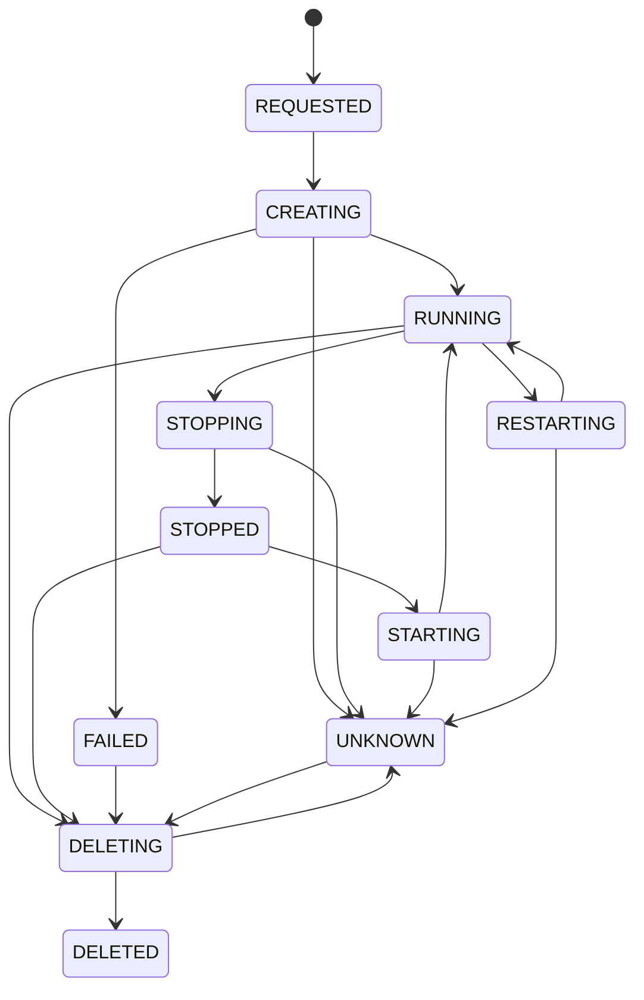

# ComputeHub 架构与接口说明

## 设计目标

ComputeHub 使用“模块化业务单体 + 独立 Mock Engine”。业务事务集中在一个 MySQL 数据库内，既能清楚表达租户、实例和账务边界，也为后续拆分独立服务保留稳定接口。

当前交付链路使用 MySQL Outbox Worker + gRPC，不引入消息队列。Redis 只用于快速防重，不承担最终正确性；Redis 暂时不可用时，MySQL 唯一键、行锁、Inbox 和 Outbox 仍负责数据一致性。

## 模块边界

- `auth/security`：JWT 登录、BCrypt、RBAC、当前用户与租户上下文。
- `catalog`：租户、用户、角色、产品、集群与节点。
- `instance`：订单、实例全生命周期、幂等响应、批量操作和查询。
- `billing`：钱包行锁、充值、冻结、实扣、解冻和不可变流水。
- `engine`：Outbox 投递、gRPC 客户端、回调验签、任务恢复和人工对账。
- `mock-engine`：命令持久化防重、异步执行、状态查询、回调和模拟指标。

## 创建实例与资金结算



成功回调把冻结金额转为实扣并追加 `DEDUCT` 流水；明确失败时返还可用余额并追加 `UNFREEZE` 流水。通信重试耗尽后，实例和任务进入 `UNKNOWN`，冻结金额保持不变，避免未知结果被错误退款。

## 实例状态机



所有写操作先由服务端状态机校验，再创建独立异步任务。一个实例同时只允许一个活动任务。停止、启动、重启和删除不会重复收费；创建订单的费用只结算一次。

## 可靠投递与恢复

1. 业务事务同时写实例、任务和 Outbox。
2. Worker 使用 `FOR UPDATE SKIP LOCKED` 分批领取可执行事件。
3. 每次重试使用相同 `command_id`，Mock Engine 以数据库唯一键防重。
4. Mock Engine 持久化命令状态，进程重启后恢复未完成命令。
5. 回调以 `engine_event_id` 写入 Inbox，重复事件直接返回既有结果。
6. 超时任务进入 `UNKNOWN`；人工重试重新投递，人工对账通过 gRPC 查询已持久化的引擎事实。

Worker 通信失败时按 2、4、8 秒退避，最多尝试三次。回调包含时间戳和 HMAC-SHA256 签名，服务端拒绝过期或签名不匹配的请求。

## API 约定

外部 API 使用 `/api/v1` 前缀，统一返回：

```json
{
  "code": "SUCCESS",
  "message": "ok",
  "data": {},
  "traceId": "..."
}
```

常见状态码：400 参数错误、401 未登录、403 无权限、404 资源在当前租户不可见、409 幂等冲突或非法状态、422 余额不足。

创建实例、实例操作和充值写接口使用 `Idempotency-Key`。相同 Key 和相同请求重放第一次结果；相同 Key 搭配不同请求返回 409。平台管理员在跨租户操作时显式提供 `tenantId`，普通租户用户始终使用 JWT 中的租户身份。

主要接口分组：

- `/auth`：登录和当前用户。
- `/tenants`、`/users`、`/roles`：租户与权限。
- `/products`、`/clusters`：产品和资源。
- `/instances`：查询、创建、生命周期和批量操作。
- `/tasks`：任务列表、详情、重试和对账。
- `/wallet`、`/billing/ledgers`：钱包、充值和账务流水。
- `/dashboard`、`/metrics`：总览和集群指标。
- `/internal/engine/events`：Mock Engine 签名回调。

完整请求模型和响应模型以运行中的 Swagger 为准。

## 扩展方向

真实 Kubernetes、云厂商或智算平台适配器可以实现现有 gRPC 契约，不改变业务层订单、幂等和结算规则。业务规模扩大后，可以将 Outbox 下游替换为可靠消息中间件，并按租户中心、资源中心、订单中心和费用中心拆分；账务唯一键、状态机和回调 Inbox 仍应保持。
