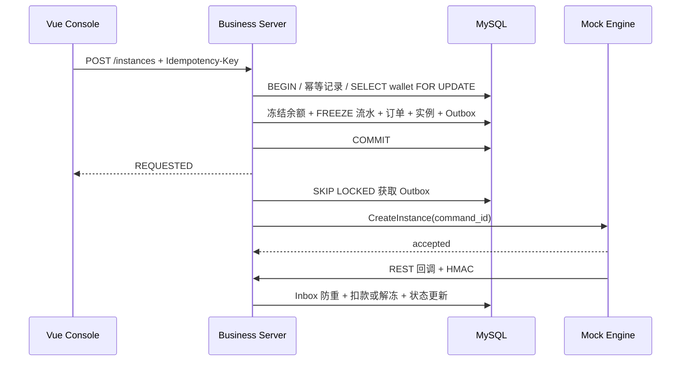

# ComputeHub 架构与接口说明

## 模块边界

业务服务采用模块化单体，事务边界集中在同一个数据库内，适合三天 Demo，也保留拆分服务的能力：

- `auth/security`：JWT、RBAC、当前用户与租户上下文。
- `catalog`：租户、用户、角色、产品、集群与节点。
- `instance`：订单、实例创建、幂等响应与查询。
- `billing`：钱包行锁、充值和不可变流水。
- `engine`：Outbox、gRPC 客户端、回调验签、结算和人工对账。

Redis 不承担最终正确性。即使 Redis 暂时不可用，数据库唯一键、行锁、Inbox/Outbox 仍能避免重复订单和资损。

## 创建实例时序

任务等待回调超过三秒后按 2、4、8 秒节奏重试。三次耗尽进入 `UNKNOWN`；`RUNNING` 和 `FAILED` 是终态，`UNKNOWN` 可以接受迟到结果。

## API 约定

外部 API 使用 `/api/v1` 前缀；所有响应包含 `code`、`message`、`data` 和 `traceId`。写接口返回 400 参数错误、401 未登录、403 无权限、409 幂等冲突或非法状态、422 余额不足。

创建实例和充值必须传 `Idempotency-Key`。相同 Key 与请求体会重放原响应；相同 Key 搭配不同请求体返回 409。

主要接口可直接在 Swagger 中调用。平台管理员操作钱包或创建实例时需显式提供 `tenantId`；普通租户用户的 `tenantId` 始终从 JWT 中取得，忽略客户端越权输入。

## 扩展路径

真实 Kubernetes 或云厂商适配器只需实现 `ComputeEngine` gRPC 契约。生产化时可将 Outbox 投递替换为 Kafka/RabbitMQ，将模块化单体按租户中心、资源中心、订单中心和计费中心拆分，但账务幂等键与状态机保持不变。
